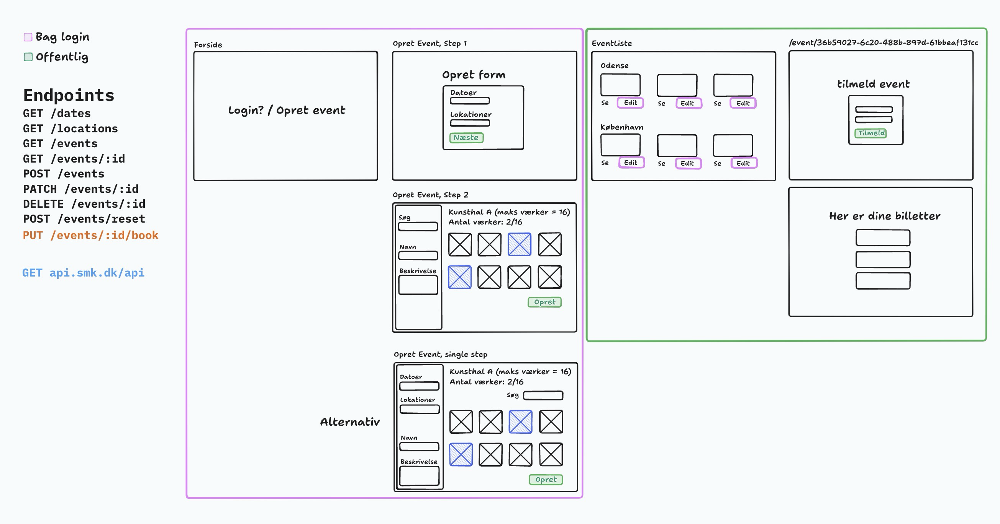

# Frontend-eksamensprojekt – Overblik og krav

## Overblik

I skal udvikle et frontend-projekt for Statens Museum for Kunst (SMK). Projektet består af to hovedområder:

1. **Kurator-området** (bag login)

   - Kuratoren skal kunne logge ind og oprette, rette samt slette events.
   - Ved oprettelse eller redigering af et event skal kuratoren kunne søge og vælge kunstværker fra SMK's API og tilføje dem til det pågældende event.

2. **Offentligt område**
   - Alle besøgende (uden login) kan se en oversigt over eksisterende events og klikke sig ind på en detaljeret side for hvert event.
   - Herfra skal de kunne booke billetter, såfremt der er pladser tilbage.

### Wireframes

Følgende wireframe-illustration viser en mulig opdeling af systemet:

- Forside (offentlig): Viser login/åbningsmulighed for kuratoren eller en liste over events.
- Kurator-side (bag login): Opret form, vælg SMK-værker, ret eksisterende events.
- Offentlig eventside: Viser oversigt over værker, dato, lokation mm. Indeholder booking-formular.

## Krav til systemet

### 1. Oprettelse og vedligeholdelse af events (bag login)

- Kuratorer kan logge ind (fx via Clerk) og se et interface til oprettelse af et nyt event.
- Et event skal indeholde:
  - Titel (obligatorisk)
  - Beskrivelse (obligatorisk)
  - Dato (skal være én af de foruddefinerede datoer fra `/dates`)
  - Lokation (hentes fra `/locations`)
  - Værker (et array af værk-ID'er fra SMK's API).
- Kuratoren kan gemme disse events i systemet, samt rette eller slette eksisterende events.
- Kuratoren skal kunne se en oversigt over eksisterende events med muligheder for at:
  - Redigere eventet (ret dato, beskrivelse, værker m.v.)
  - Slette eventet

### 2. Offentlig visning (ingen login påkrævet)

- En liste over alle events (dem, der er synlige for offentligheden).
- For hvert event en detalje-side, der viser:
  - Titel, dato, lokation, beskrivelse
  - De tilknyttede værker fra SMK (med billeder/metadata/mm.)
    - Detalje-side for et værk.
      - Visning af lignende værker.
- Brugeren skal kunne booke billetter til eventet (`/events/:id/book`).
- Booking-flowet skal tjekke, om eventet stadig har ledige pladser.

> [!NOTE]
> Denne side skal visuelt adskille sig fra kuratorens oprettelsesflow og vise værkerne i en mere visuel præsentation.

### 3. SMK API-integration

- Ved oprettelse eller redigering af et event skal kuratoren kunne søge i SMK's API (f.eks. via et søgefelt) for at finde kunstværker, der skal tilføjes eventet.
- Hvert værk i SMK's API har en unik ID eller URL, som gemmes i eventets artworkIds-felt.
- Public side: Viser værkerne med billede (thumbnail) og relevante metadata, så besøgende kan se, hvilke værker der bliver udstillet.

### 4. Booking og grænser

- Der er et maksimalt antal billetter til eventet (defineret af lokationens kapacitet).
- Brugeren må ikke kunne booke flere billetter, end der er tilgængelige.
- Systemet opdaterer antallet af bookede billetter jævnligt, og giver feedback ved booking:
  - Succes (billetter er booket)
  - Fejl (der er ikke nok pladser tilbage)

### 5. Datavalidering og konflikthåndtering

- Et event kan ikke oprettes/ændres, hvis samme lokation allerede er optaget på den samme dato.
- Hvis booking overskrider kapaciteten, returneres en 400 Bad Request eller tilsvarende.

### 6. Login (Kurator)

- Kun kuratoren (fx via Clerk) må kunne oprette, rette og slette events.
- Offentligheden må kun se events og booke billetter.

### 7. Yderligere funktioner

- Filtrering og/eller sortering af events (f.eks. efter dato, popularitet, mm.).
- Opdel event-visningen i "publik events" og "kladder" (events, der endnu ikke er udgivet).

## User stories

| User Story                                                                                                        | Expected Behavior                                                                                                                                                                   |
| ----------------------------------------------------------------------------------------------------------------- | ----------------------------------------------------------------------------------------------------------------------------------------------------------------------------------- |
| Som kurator: Jeg vil logge ind, så kun jeg kan oprette eller slette events.                                       | Systemet præsenterer en login-side (via Clerk). Ved succesfuld login får kuratoren adgang til at se, oprette og redigere events.                                                    |
| Som kurator: Jeg vil oprette et nyt event med titel, dato, lokation, beskrivelse og udvalgte SMK-værker.          | En POST-anmodning til /events opretter et event, validerer dato og lokation, og returnerer det oprettede event med unikt ID.                                                        |
| Som kurator: Jeg vil kunne søge i SMK's API for at finde kunstværker til eventet.                                 | Frontend viser et søgefelt, der sender forespørgsler til SMK. Værker præsenteres visuelt, og kuratoren kan vælge hvilke ID'er der skal tilføjes i artworkIds.                       |
| Som kurator: Jeg vil se en liste over mine events og redigere eller slette dem, hvis nødvendigt.                  | Systemet returnerer en liste over events (via GET /events), og for hvert event en "Redigér" og "Slet"-knap. Ved sletning returneres bekræftelse, ved redigering tjekkes konflikter. |
| Som bruger: Jeg vil se en liste over tilgængelige events, så jeg kan vælge, hvilket jeg vil besøge.               | En GET-anmodning til /events returnerer offentlige events. Brugeren kan klikke ind på det enkelte event for at se detaljer.                                                         |
| Som bruger: Jeg vil se detaljer for et event (titel, lokation, billeder mv.), så jeg kan få de fulde oplysninger. | En GET-anmodning til /events/:id returnerer detaljer om det valgte event, inklusiv SMK-værker.                                                                                      |
| Som bruger: Jeg vil booke billetter, så jeg er sikker på en plads.                                                | En PUT-anmodning til /events/:id/book tjekker tilgængeligt billetantal, booker billetter og returnerer det opdaterede event.                                                        |

---

Formålet med opgaven er at bygge et sammenhængende og velfungerende event management system, hvor der er en klar opdeling mellem kurator-området (beskyttet) og den offentlige eventside (alle kan tilgå). I skal varetage oprettelse, redigering og sletning af events (inklusive tilknytning af kunstværker via SMK API) samt give slutbrugere mulighed for at booke billetter.

I skal sikre en god UX, herunder beskeder ved fejl (f.eks. konflikt i dato+lokation) og tydelig formvalidering. Formålet er, at kuratoren let kan oprette og fremvise events, mens offentligheden nemt finder info og booker billetter, hvis de ønsker at deltage.
