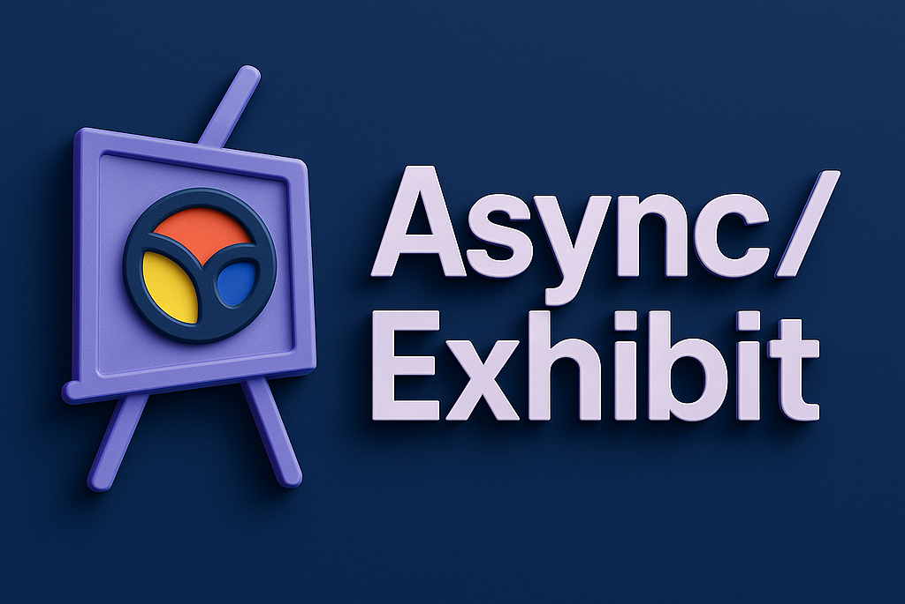

"Exhibitions. Asynchronously curated."

# Frontend-eksamensprojekt 2025

## Kort fortalt

I skal lave et Event Management System for en kurator fra Statens Museum for Kunst (SMK), hvor denne skal kunne oprette events og tilknytte værker fra SMK's API. Besøgende skal kunne se en liste over events og booke billetter hertil.

Kurator-funktionerne skal være beskyttet bag et login.

Se flere detaljer og krav til opgaven i [opgavebeskrivelsen](OPGAVE.md).

---

## Nødvendige ressourcer

For at løse opgaven skal I bruge følgende:

- En backend-server - se [vejledning til opsætning](REMOTESERVER.md)
- [SMK API](https://api.smk.dk/api/v1/docs/) - (læs evt. også [om API'et](https://www.smk.dk/article/om-smk-open/))
- [Clerk](CLERK.md) til autentificering
- Evt. Supabase til opsamling af data på billetter

## Om projektet

Dette projekt er udviklet som del af eksamen i frontend-valgfaget på KEA. Det simulerer en realistisk API til håndtering af kunst-events og billetbestilling.
