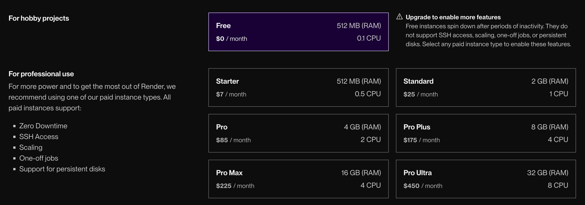

# Frontend valgfag

## Deployment med Render

### Hvad er dette?

For at løse eksamensopgaven skal du forbinde din frontend til et backend, som vi har bygget.

Du har kun brug for én server pr. gruppe, så vælg én til at gøre det. Vi bruger render.com, da det er gratis.

### Fjernserver på Render

Følg disse trin for at deploye dit repository via GitHub:

1. **Fork repository:**

   - Fork dette repository, så du har din egen version på GitHub.

2. **Opret en konto på Render:**

   - Gå til [Render](https://render.com) og log ind med din GitHub-konto.

3. **Opret en ny Web Service:**

   - Klik på "New" og vælg "Web Service".
   - Vælg dit repository fra GitHub.
   - Konfigurer buildindstillingerne – se næste punkt.

4. **Vælg Free og Region:**

   - I deployment-indstillingerne skal du vælge **Free**.
     
   - Sæt din "Region" til **Frankfurt** for optimal performance.

5. **Deployment færdiggøres:**

   - Klik på "Deploy Web Service".
   - Når deployment er færdig, vil Render give din server et unikt domænenavn, f.eks. `your-app-name.onrender.com`.

6. **Test din server:**
   - Besøg din applikation via URL'en (fx `https://your-app-name.onrender.com`).
   - Tilføj endpointet `/events` til URL'en for at sikre, at backend'en kører korrekt (fx `https://your-app-name.onrender.com/events`).

### Lokal Server (under udvikling)

Bør bruges under udvikling. Det er hurtigere og bruger færre ressourcer.

1. Klon dit repository.
2. Kør `npm install`.
3. Kør `npm run dev`.

Dette vil starte en server på `http://localhost:8080`. Åbn denne URL i din browser og tilføj `/events` for at teste backend'et.

### Bemærk venligst

**Dvale:** Render's gratis-version har en inaktivitetstid (ca. 15 minutter) før applikationen går i dvale for at spare ressourcer. Dette vil sandsynligvis forstyrre Next.js ved serverside-fetching, hvilket er OK — det er trods alt en gratis service. Opdater blot siden, så virker alt fint.

Hvis din applikation går i dvale, starter den op igen – men der kan opstå en kort forsinkelse (op til 50 sekunder) ved den første anmodning. Derfor kan det være en god idé at implementere en loader/spinner i jeres frontend (fx loading.js).

### Endpoints

Alle endpoints til jeres backend er dokumenteret her: [API Documentation](https://daviatkea.github.io/API/).

---

Held og lykke med deployment, og sørg for at teste din løsning, så frontend og backend integreres uden problemer!
