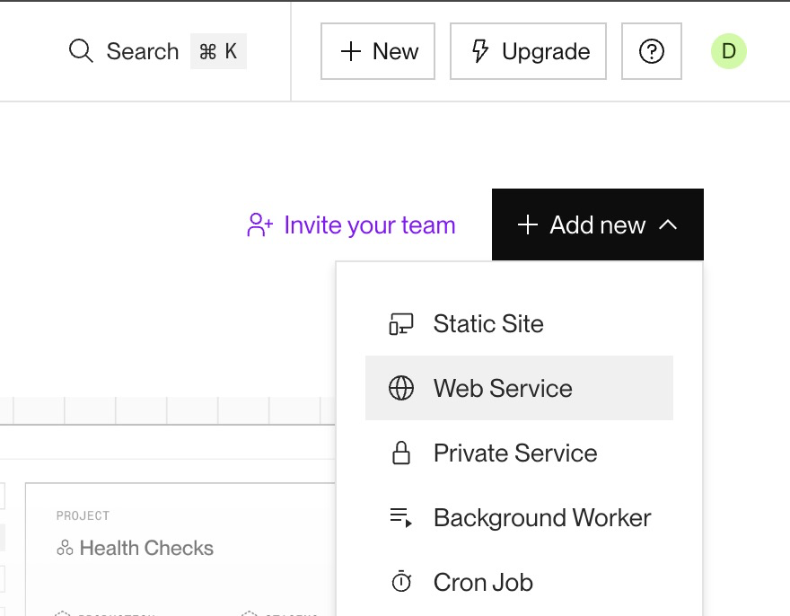

# Deployment med Render

Da I ikke kan aflevere jeres eksamensprojekt med en lokal udviklingsserver, skal I deploye jeres backend til en fjernserver, inden I afleverer.

Det er en god idé at gøre det tidligt i forløbet, så I kan teste jeres frontend mod den deployede backend en gang i mellem.

I har kun brug for én fjernserver pr. gruppe, så vælg vedkommende, der ejer eksamensprojektets repository til at gøre det.

Vi bruger render.com, da det er gratis.

## Fjernserver på Render

Følg disse trin for at deploye din backend (via GitHub):

1. **Opret en konto på Render:**

   - Gå til [Render](https://render.com) og log ind med din GitHub-konto.

2. **Opret en ny Web Service:**

   - Klik på "New" eller "Add new" og vælg "Web Service".
     
   - Vælg dit repository fra GitHub.
   - Konfigurer buildindstillingerne – se næste punkt.

3. **Vælg Free og Region:**

   - I deployment-indstillingerne skal du vælge **Free**.
     
   - Sæt din "Region" til **Frankfurt** for optimal performance.

4. **Deployment færdiggøres:**

   - Klik på "Deploy Web Service".
   - Når den har deployet, vil Render give din server et unikt domænenavn, f.eks. `your-app-name.onrender.com`.

5. **Test din server:**
   - Besøg din applikation via URL'en (fx `https://your-app-name.onrender.com`).
   - Tilføj endpointet `/events` til URL'en for at sikre, at backend'en kører korrekt (fx `https://your-app-name.onrender.com/events`).

### Bemærk venligst

Render's gratis-version har en inaktivitetstid (ca. 15 minutter) før applikationen går i dvale for at spare ressourcer.

Hvis din applikation går i dvale, starter den op igen – men der kan opstå en kort forsinkelse (op til 50 sekunder) ved den første anmodning. Dette vil sandsynligvis forstyrre Next.js ved serverside-fetching, hvilket er OK — det er trods alt en gratis service. Opdater blot siden, så virker alt fint.
Det kan derfor være en god idé at implementere en loader/spinner i jeres frontend (fx loading.js).
